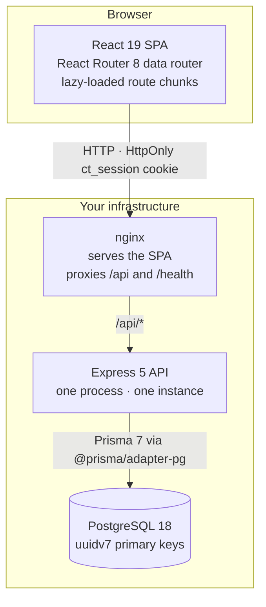

# Custotal

[](https://www.apache.org/licenses/LICENSE-2.0)
[](https://github.com/orbivort/custotal/actions/workflows/ci.yml)
[](https://github.com/orbivort/custotal/releases/latest)

[](./tsconfig.base.json)
[](#requirements)
[](https://www.postgresql.org/)

**Your customer data, in your custody.**

Custotal is a self-hosted CRM that a small sales team can actually run: one API
process, one PostgreSQL database, one Compose file — and no third party holding
your customer list.

Out of the box it covers the working surface of a sales team — contacts and
accounts, interaction history, a configurable deal pipeline, tasks, and
reporting — behind email/password authentication with server-side role-based
access control.

> **Status:** MVP. The core workflows are implemented and covered by automated
> tests. Operational hardening items and known limitations are tracked in
> [`packages/backend/docs/operations-notes.md`](packages/backend/docs/operations-notes.md).

> **One instance, by design.** The API assumes exactly one process: rate-limit
> counters live in memory and the soft-delete purge runs on an in-process timer.
> Run a single container and scale vertically — see
> [operations notes §1](packages/backend/docs/operations-notes.md) before
> planning a second replica.

## Table of contents

- [Why Custotal](#why-custotal)
- [Features](#features)
- [Architecture at a glance](#architecture-at-a-glance)
- [Tech stack](#tech-stack)
- [Requirements](#requirements)
- [Quick start](#quick-start)
- [Docker](#docker)
- [Configuration](#configuration)
- [Commands](#commands)
- [Project structure](#project-structure)
- [Documentation](#documentation)
- [Roadmap](#roadmap)
- [FAQ](#faq)
- [Contributing](#contributing)
- [Security](#security)
- [Acknowledgements](#acknowledgements)
- [License](#license)

## Why Custotal

### Who it is for

A B2B sales team of roughly **3 to 15 people** that already runs its own
infrastructure — and that either cannot or will not hand its customer list to a
SaaS vendor, whether for contractual, regulatory, or simply philosophical
reasons. That team wants a CRM it can stand up in an afternoon and still be
running, unchanged, in three years.

### What it is not

Custotal is deliberately narrow. It is **not** a platform, not a marketing
suite, and not a service you sign up for. It has one pipeline configuration,
one tenant, and one administrator. If you need marketing automation, a service
desk, CPQ, or native mobile apps, this is the wrong tool — and
[Roadmap](#roadmap) lists the things that are out of scope on purpose.

### Why not something else?

Every alternative is a trade-off. Custotal's trade-off is that you own the
system. That is the whole point.

| Dimension                      | Custotal                                                  | SaaS CRM                                                   | Heavyweight self-hosted CRM                          |
| ------------------------------ | --------------------------------------------------------- | ---------------------------------------------------------- | ---------------------------------------------------- |
| Where your customer data lives | **Your PostgreSQL database**                              | The vendor's cloud                                         | Your database                                        |
| Time to a working workspace    | **~5 minutes: clone, install, migrate, create one admin** | Minutes to sign up, then configuration to fit your process | Days to weeks: stack, modules, permissions, upgrades |
| What you operate               | **One API process and one SPA. Compose stack included**   | Nothing                                                    | Several services plus a broad configuration surface  |
| Scope                          | **Focused on small-team selling**                         | Very broad: automation, service desk, CPQ                  | Very broad, extensible by design                     |
| Ongoing cost                   | **Your infrastructure; no per-seat fee**                  | Per seat, recurring                                        | Your infrastructure plus admin time                  |
| Getting your data in           | **CSV import wizard with column mapping and dry run**     | Vendor-dependent exports                                   | Often a scripted migration                           |

SaaS CRMs win on "there is nothing to operate", and heavyweight open-source
CRMs win on configurability. Custotal trades both away for a system you can
read end to end, run on one box, and walk away from without asking permission.

## Features

- **Customers** — every contact and account in one place, with role links
  between them (who works where, who to bill) and full audit fields, so you can
  see who changed what and when. Deleted records stay recoverable for 30 days.
- **Interactions** — log emails, calls, meetings and notes (plus an "other"
  type) with channel and direction, attached to the contact, account and deal
  they belong to, on one reverse-chronological timeline. Nobody has to ask "did
  anyone follow up?"
- **Pipeline** — drag a deal between stages on a kanban board; every move is
  recorded, the probability updates itself, and closed-lost deals require a
  reason. You get a forecast you can trust without chasing anyone for a status
  update.
- **Tasks** — my-tasks and all-tasks views with filters, sorting and completion
  history, overdue work highlighted and counted in the header. The next action
  stays visible, so no deal goes quiet by accident.
- **Reports** — pipeline-by-stage and win/loss, with charts and CSV export, so
  you can answer "where is revenue actually stuck?" and take the numbers to a
  meeting.
- **Search** — one box, grouped results across contacts, accounts and
  opportunities, so finding a record takes seconds.
- **CSV import** — an admin wizard that maps your existing columns, handles
  duplicates, and runs a dry run before anything is written. Leaving a
  spreadsheet or another CRM behind is a guided job, not a script you write.
- **Access control** — email/password sign-in with database-backed sessions,
  server-side roles (admin / manager / rep), and owner-scoped visibility, so a
  representative sees their book and not everyone else's.
- **Recovery** — a 30-day trash with admin restore and purge: a deleted contact
  is recoverable, not gone.
- **Operations** — structured logs, `/health` probes, rate limiting, backup and
  purge scripts, and a documented restore runbook, so an operator can run this
  without paging a maintainer.

## Architecture at a glance



Requests flow `routes` → `services` → `db`; the API validates and authorizes in
the router layer and keeps business logic, transactions and RBAC scoping in the
service layer. Under `pnpm dev` there is no nginx: Vite serves the SPA on `:5173`
and proxies `/api` to the API on `:4000`, keeping requests same-origin so the
session cookie flows.

[docs/architecture.md](docs/architecture.md) covers the middleware order, the
error envelope, and the data-model conventions in detail.

## Tech stack

| Layer    | Stack                                                            |
| -------- | ---------------------------------------------------------------- |
| Backend  | Node 24 · Express 5 · Prisma 7 · PostgreSQL 18 · pino            |
| Frontend | React 19 · Vite 8 · React Router 8 · Tailwind CSS 4              |
| Tooling  | TypeScript 6 (strict) · Vitest 4 · ESLint · Prettier · Stylelint |
| Monorepo | pnpm workspaces with a shared dependency catalog                 |

## Requirements

**Supported platforms:** developed on Windows and Linux, and exercised in CI on
Linux — every job in [`ci.yml`](.github/workflows/ci.yml) runs on `ubuntu-latest`.
The code is platform-neutral with no native build steps, and the Docker path
works anywhere Docker with Compose v2.24 or newer is available. macOS is expected
to behave identically but is not covered by CI.

Running from source requires:

- **Node** `^24.19.0` and **pnpm** `^11.21.0` (enforced through `engines`).
- **PostgreSQL 18+** — all primary keys use the built-in `uuidv7()` default, so
  older majors will fail migrations.

For a production deployment you will also want an SMTP server (invitations and
password resets) and a TLS-terminating reverse proxy. The [Docker](#docker) path
needs only Docker with Compose v2.24 or newer.

## Quick start

### Linux and macOS

```bash
git clone https://github.com/orbivort/custotal.git
cd custotal
pnpm install

# 1. Backend environment — set DATABASE_URL (and TEST_DATABASE_URL) in the copy
cp packages/backend/.env.example packages/backend/.env
pnpm --filter @custotal/backend db:migrate:deploy

# 2. Create the first administrator (there is no registration flow)
ADMIN_EMAIL=you@example.com pnpm --filter @custotal/backend db:create-admin

# 3. Frontend environment (optional; only needed to enable dev mocks)
cp packages/frontend/.env.example packages/frontend/.env.local

# 4. Start both dev servers (frontend :5173, backend :4000)
pnpm dev
```

### Windows (PowerShell)

```powershell
git clone https://github.com/orbivort/custotal.git
cd custotal
pnpm install

# 1. Backend environment — set DATABASE_URL (and TEST_DATABASE_URL) in the copy
Copy-Item packages/backend/.env.example packages/backend/.env
pnpm --filter @custotal/backend db:migrate:deploy

# 2. Create the first administrator (there is no registration flow)
$env:ADMIN_EMAIL = 'you@example.com'
pnpm --filter @custotal/backend db:create-admin

# 3. Frontend environment (optional; only needed to enable dev mocks)
Copy-Item packages/frontend/.env.example packages/frontend/.env.local

# 4. Start both dev servers (frontend :5173, backend :4000)
pnpm dev
```

`create-admin` reads `ADMIN_EMAIL` from the environment and also loads
`packages/backend/.env`; set `ADMIN_PASSWORD` to choose the password yourself,
or omit it and the script prints a generated temporary credential once and
forces a change at first sign-in.

Open <http://localhost:5173> and sign in with the administrator account created
above.

To try the UI **without a database**, set `VITE_ENABLE_MOCKS=true` in
`packages/frontend/.env.local` and run `pnpm dev` — Mock Service Worker serves a
seeded demo workspace in development only. It is never active outside the Vite
dev server, and the flag must not be `true` in a production build.

For a production deployment, see [`docs/self-hosting.md`](docs/self-hosting.md).

## Docker

Container images and a Compose stack are provided for self-hosting, so Docker is
the only prerequisite — Node and pnpm are not needed on the host. If you do have
pnpm, the `docker:*` scripts in the root `package.json` wrap the Compose commands
so the `--env-file` flag is never typed by hand:

```bash
cp .env.docker.example .env.docker    # set POSTGRES_PASSWORD at minimum
pnpm docker:up                        # = docker compose --env-file .env.docker up -d --build
```

`.env.docker` is the single environment file the stack reads: Compose
substitutes from it, and the API container receives its application settings
from it (SMTP, locale, retention, purge schedule). A raw `docker compose` call
still needs `--env-file .env.docker` (`pnpm docker:down`, `pnpm docker:logs`,
`pnpm docker:migrate`, … are the wrapped equivalents), because Compose only
auto-loads a file named `.env`. The stack never reads the development file
`packages/backend/.env`.

The workspace is served from <http://localhost:8080>. A one-shot `migrate`
service applies pending database migrations before the API starts, so the first
run only needs the first administrator:

```bash
docker compose --env-file .env.docker exec -e ADMIN_EMAIL=you@example.com backend node scripts/create-admin.ts
```

That line is one command, not a wrapped one — keep it on a single line in
PowerShell, where `\` is not a line continuation.

Both images are multi-stage and run as a non-root user with a container health
check. Tagged builds publish them to the GitHub Container Registry
(`ghcr.io/orbivort/custotal-backend`, `ghcr.io/orbivort/custotal-frontend`); set
`CUSTOTAL_TAG` in `.env.docker` to pull a released version instead of building
locally. The backend is published twice from one Dockerfile: the API image
(production dependencies only) and the matching `<tag>-tools` variant that the
one-shot `migrate` service uses — the only one shipping the Prisma CLI. The
Compose stack runs production-parity images; use `pnpm dev` for live-reload
development. See [Docker deployment](docs/self-hosting.md#docker) for
configuration, migrations, backups, and upgrades.

Both images resolve their npm/pnpm packages from `https://registry.npmjs.org/`
by default. To build through a mirror, set `NPM_REGISTRY` in `.env.docker` (used
by `docker compose`) or pass `--build-arg NPM_REGISTRY=<mirror-url>` to
`docker build`.

## Configuration

Custotal is configured entirely through environment variables, parsed and
validated eagerly at backend startup. The two supported setups differ only in
where the values live:

- **From source** — `packages/backend/.env` (copy from `.env.example`, which is
  the annotated master list), plus `packages/frontend/.env.local` for the SPA.
- **Docker** — a single `.env.docker` at the repository root (copy from
  `.env.docker.example`); the stack does not read `packages/backend/.env`.

The settings that most affect a deployment:

| Variable          | Purpose                                                                                 |
| ----------------- | --------------------------------------------------------------------------------------- |
| `DATABASE_URL`    | PostgreSQL connection string.                                                           |
| `NODE_ENV`        | Set to `production` in a deployment.                                                    |
| `COOKIE_SECURE`   | Must be `true` behind HTTPS (defaults to `true` in production).                         |
| `CORS_ORIGINS`    | Exact frontend origin(s); used by CORS and the CSRF origin check.                       |
| `TRUST_PROXY`     | Set behind a reverse proxy so `req.ip` (and rate limiting) resolves to the real client. |
| `APP_PUBLIC_URL`  | Public frontend origin used to build invite/reset links.                                |
| `SMTP_*`          | Mail delivery. Left empty, the mailer logs instead of sending (development only).       |
| `TENANT_TIMEZONE` | IANA name used for date-only semantics and "overdue" calculation (default `UTC`).       |
| `BACKUP_*`        | Backup destination and retention window (defaults `./backups`, `30` days).              |
| `MAINTENANCE_*`   | In-process soft-delete purge schedule (default 02:00 server-local).                     |

Frontend variables are baked in at build time, so changing one requires a
rebuild. The most relevant are `VITE_API_BASE_URL` (leave empty for a
same-origin deployment) and `VITE_ENABLE_MOCKS` (must **not** be `true` in
production).

The backend logs production configuration warnings at startup for unsafe
combinations. See [Self-hosting → Configuration](docs/self-hosting.md#configuration)
for the full annotated reference and a production checklist.

## Commands

Run from the repository root:

| Task                          | Command                         |
| ----------------------------- | ------------------------------- |
| Both dev servers              | `pnpm dev`                      |
| Frontend production build     | `pnpm build`                    |
| Typecheck (frontend+backend)  | `pnpm typecheck`                |
| ESLint (whole workspace)      | `pnpm lint`                     |
| Stylelint (frontend CSS)      | `pnpm lint:css`                 |
| Prettier formatting check     | `pnpm format:check`             |
| All tests                     | `pnpm test`                     |
| Frontend tests only           | `pnpm test:frontend`            |
| Backend unit tests only       | `pnpm test:backend:unit`        |
| Backend integration tests     | `pnpm test:backend:integration` |
| Backend e2e tests             | `pnpm test:backend:e2e`         |
| Browser journeys (Playwright) | `pnpm test:e2e`                 |
| Apply database migrations     | `pnpm db:migrate`               |
| Create the first admin        | `pnpm db:create-admin`          |
| Back up the database          | `pnpm backup`                   |
| Purge soft-deleted records    | `pnpm purge`                    |
| Backup + purge in one run     | `pnpm maintenance`              |
| Dependency audit              | `pnpm audit`                    |
| Docker: start or rebuild      | `pnpm docker:up`                |
| Docker: stop                  | `pnpm docker:down`              |
| Docker: follow logs           | `pnpm docker:logs`              |
| Docker: apply migrations      | `pnpm docker:migrate`           |

`pnpm backup` and `pnpm purge` operate on `DATABASE_URL` and need `pg_dump` on
`PATH`; see the [restore procedure](packages/backend/docs/restore-procedure.md)
before relying on either.

Run a single test file through its package, for example:

```bash
pnpm --filter @custotal/frontend exec vitest run src/lib/format.test.ts
```

## Project structure

```
custotal/
├─ packages/
│  ├─ backend/     Express API, Prisma schema + migrations, scripts, tests
│  │  ├─ src/      index → app → routes → services → db
│  │  ├─ prisma/   schema.prisma + migrations
│  │  ├─ scripts/  create-admin, backup, purge
│  │  ├─ Dockerfile
│  │  └─ docs/     operations notes, restore runbook
│  └─ frontend/    React SPA (routing, features/*, mocks, tests)
│     ├─ src/      features/*, components/*, lib/*, mocks/*, types/
│     ├─ docker/   nginx.conf used by the container image
│     ├─ Dockerfile
│     └─ docs/     API integration guide
├─ docker-compose.yml  self-hosted stack (PostgreSQL + API + nginx)
├─ docs/           architecture, self-hosting, API reference
└─ .github/        CI, security scanning, issue/PR templates
```

Frontend entry is `src/main.tsx` → `src/App.tsx` (the single route table);
per-domain service modules in `src/features/*/*Api.ts` are the only place
allowed to import the HTTP client or write `/api/...` paths.

## Documentation

- [Architecture](docs/architecture.md) — how the backend and frontend fit together.
- [Self-hosting](docs/self-hosting.md) — configuration, deployment, backups, and upgrades.
- [API reference](docs/api.md) — REST endpoints and the error envelope.
- [Operations notes](packages/backend/docs/operations-notes.md) — known limitations and deferred work.
- [Restore procedure](packages/backend/docs/restore-procedure.md) — backup/restore runbook.
- [Frontend API integration](packages/frontend/docs/api-integration.md) — the service-layer contract.
- [Changelog](CHANGELOG.md) — released changes, newest first.

## Roadmap

Custotal 1.0.0 is an MVP: the core workflows are implemented, tested, and usable
today. What is deferred is recorded, not promised — the items below come from
[operations notes](packages/backend/docs/operations-notes.md).

Known gaps, each intentional at the single-instance MVP stage:

- A shared rate-limit store (Redis), which is the prerequisite for running a
  second API replica.
- Metrics or an APM agent — structured pino logs are the observability surface.
- Clearing optional fields to empty over `PATCH`.
- Native `bcrypt` / `argon2id` / `crypto.scrypt` if login volume outgrows
  `bcryptjs`.

Deliberately out of scope — the focus is the small-team sales job, so these stay
out until that changes:

- Multi-tenant hosting as a service; Custotal is single-tenant and self-hosted.
- Marketing automation, a service desk, and CPQ.
- Native mobile applications.
- Configuring more than one pipeline.

## FAQ

**How do I get a first account? There is no sign-up page.**
Correct — registration is intentionally absent. Provision the administrator with
`pnpm db:create-admin`. On the Docker path, `pnpm docker:create-admin` forwards
`ADMIN_EMAIL`, `ADMIN_NAME` and `ADMIN_PASSWORD` from your environment. Once you
are signed in, invite everyone else from the app as an administrator.

**Migrations fail. Why?**
Check the PostgreSQL major version. The schema uses the built-in `uuidv7()`
default for every primary key, which needs PostgreSQL 18+. See
[Requirements](#requirements).

**Sign-in is rate-limited or logs show the proxy's IP instead of the client's.**
Set `TRUST_PROXY` to your proxy hop count (the bundled Compose stack sets it to
`1`). Without it, Express resolves `req.ip` to the proxy and every client shares
one rate-limit bucket.

**I stay signed in locally over HTTP, but the cookie is missing in production.**
`COOKIE_SECURE` defaults to `true` in production and requires HTTPS. Terminate
TLS in front of the app, or set it to `false` only for a trusted plain-HTTP
deployment.

**No invite or password-reset email arrives.**
With `SMTP_*` unset, the mailer degrades gracefully: nothing is sent and the
link is written to the application log instead. That fallback is development-only
— configure SMTP for a real deployment.

**Can I run two API replicas behind a load balancer?**
Not yet. Rate-limit counters are per-process and the purge runs on an in-process
timer, so a second replica multiplies the effective limits and races the purge.
See [operations notes §1](packages/backend/docs/operations-notes.md).

**Can I evaluate the UI without installing PostgreSQL?**
Yes — set `VITE_ENABLE_MOCKS=true` and run `pnpm dev`. You still need a clone and
`pnpm install`, but no database.

**How do I restore from a backup?**
Follow the [restore procedure](packages/backend/docs/restore-procedure.md). The
`backup` and `purge` scripts are separate processes, so backups keep running even
when the application is down.

**Why is the root `package.json` marked `private`?**
Because Custotal is an application you deploy, not a library published to npm.
The source is Apache-2.0 and free to use, modify, and self-host.

## Contributing

Contributions are welcome — bug reports, documentation improvements, and pull
requests alike. Please read [CONTRIBUTING.md](CONTRIBUTING.md) and the
[Code of Conduct](CODE_OF_CONDUCT.md) first.

In short:

- Open an issue before starting anything large so the approach can be agreed.
- Follow the quality gate CI runs: `pnpm typecheck`, `pnpm lint`,
  `pnpm lint:css`, `pnpm format:check`, and `pnpm test`.
- Use [Conventional Commits](https://www.conventionalcommits.org/) and sign off
  every commit (`git commit -s`).
- Changes that touch the API contract must update every layer together — see the
  contract-parity section in CONTRIBUTING.md.

Questions that are not bug reports or feature requests belong in
[GitHub Discussions](https://github.com/orbivort/custotal/discussions); see
[SUPPORT.md](SUPPORT.md) for what maintainers can and cannot help with.

## Security

Please **do not** open public issues for security problems. Report them privately
as described in [SECURITY.md](SECURITY.md). Key properties include opaque
database-backed sessions (only the token digest is stored), HttpOnly/Secure
cookies, bcrypt password hashing, server-side RBAC, per-endpoint rate limiting,
CSRF origin checks, and no PII in production logs.

## Acknowledgements

- Built on [Express](https://expressjs.com/), [Prisma](https://www.prisma.io/),
  [React](https://react.dev/), [Vite](https://vite.dev/),
  [React Router](https://reactrouter.com/), and
  [Tailwind CSS](https://tailwindcss.com/).
- Typography uses IBM Plex fonts, served via
  [@fontsource](https://fontsource.org/), under the SIL Open Font License 1.1.
- Thanks to the maintainers of every open-source dependency this project relies
  on — see [NOTICE](NOTICE) for attribution details.

## License

Licensed under the [Apache License 2.0](LICENSE). See [NOTICE](NOTICE) for
third-party attribution.
